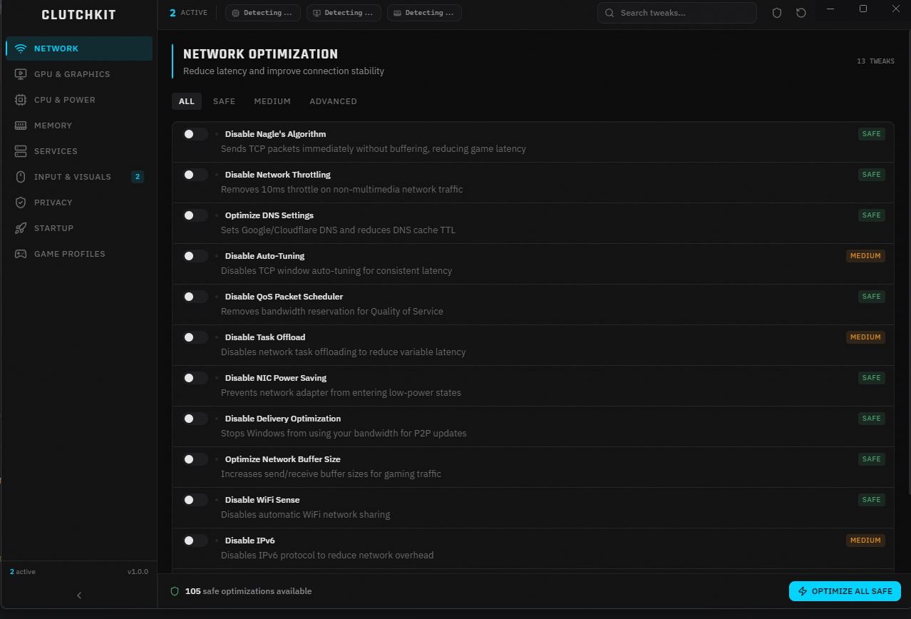

# ClutchKit Landing Page

The official landing page for **ClutchKit** — a free, open-source Windows optimization tool that reduces input lag, boosts FPS, and fine-tunes your system with zero bloat and zero telemetry.

Built with React 19, TypeScript, Tailwind CSS 4, and Framer Motion 12.



## Tech Stack

| Technology | Version | Purpose |
|------------|---------|---------|
| [React](https://react.dev) | 19 | UI framework |
| [TypeScript](https://typescriptlang.org) | 5.9 | Type safety |
| [Vite](https://vite.dev) | 7 | Build tool & dev server |
| [Tailwind CSS](https://tailwindcss.com) | 4 | Utility-first styling |
| [Framer Motion](https://motion.dev) | 12 | Animations & scroll effects |
| [Lucide React](https://lucide.dev) | 0.564 | Icon library |

## Features

- **Parallax hero** with scroll-linked screenshot transforms
- **Word-by-word text reveal** animation with blur-to-clear effect
- **3D card tilt** with cursor-following glow on hover
- **Scroll progress indicator** fixed at the top of the viewport
- **Button micro-interactions** — spring hover/tap scaling
- **Diversified entrance animations** — fade, scale, blur, and directional variants per section
- **Staggered CountUp timers** with cascading delays
- **Comparison table row-by-row reveal** with cyan flash highlights
- **Testimonial animations** — quote mark scaling, center-out divider draw
- **Animated connector lines** in the How It Works section
- **Floating ambient elements** in the hero background
- **CSS dot grid backgrounds** with radial mask fading
- **Pulsing gradient glow** via CSS keyframes (hero + download sections)
- **Navbar border glow** — subtle cyan shadow on scroll
- **Scrollbar accent** on hover
- **Full `prefers-reduced-motion` support** — all animations disabled gracefully
- **Touch device detection** — 3D tilt disabled on coarse pointers
- **Image lazy loading** with blur-up opacity transition

## Project Structure

```
src/
├── App.tsx                             # Root layout
├── index.css                           # Global styles, CSS variables, keyframes
├── main.tsx                            # Entry point
├── components/
│   ├── ui/
│   │   ├── AnimateIn.tsx               # Scroll-triggered animation wrapper (6 variants)
│   │   ├── Badge.tsx                   # Badge component
│   │   ├── Button.tsx                  # motion.a / motion.button with spring physics
│   │   ├── CountUp.tsx                 # Animated number counter with stagger delay
│   │   ├── FloatingElements.tsx        # Ambient floating circles
│   │   ├── GlassCard.tsx              # Glassmorphic card with 3D tilt + cursor glow
│   │   ├── GridBackground.tsx          # CSS dot grid with radial mask
│   │   ├── ScrollProgress.tsx          # Scroll progress bar
│   │   └── TextReveal.tsx              # Word-by-word stagger animation
│   ├── sections/
│   │   ├── Hero.tsx                    # Hero with parallax, TextReveal, floating elements
│   │   ├── Stats.tsx                   # Stat counters with cascading delays
│   │   ├── Features.tsx                # Bento grid feature cards
│   │   ├── Showcase.tsx                # Interface screenshot with lazy loading
│   │   ├── Categories.tsx              # 9-category grid with directional animations
│   │   ├── HowItWorks.tsx              # 3-step cards with animated connector line
│   │   ├── Comparison.tsx              # Row-by-row animated comparison table
│   │   ├── Testimonials.tsx            # Quote cards with animated dividers
│   │   └── Download.tsx                # CTA with grid background + gradient glow
│   └── layout/
│       ├── Navbar.tsx                  # Fixed nav with scroll spy + mobile menu
│       └── Footer.tsx                  # 3-column footer with gradient border
├── data/
│   ├── categories.ts
│   ├── comparisons.ts
│   ├── features.ts
│   └── testimonials.ts
└── hooks/
    ├── useInView.ts                    # Intersection Observer hook
    ├── useMousePosition.ts             # Cursor position tracking for card effects
    ├── useReducedMotion.ts             # prefers-reduced-motion detection
    └── useScrollSpy.ts                 # Active section detection for navbar
```

## Getting Started

### Prerequisites

- [Node.js](https://nodejs.org) 18+
- npm, yarn, or pnpm

### Installation

```bash
git clone https://github.com/AbdullahiIsse/clutchkit-landing.git
cd clutchkit-landing
npm install
```

### Development

```bash
npm run dev
```

Opens at [http://localhost:5173](http://localhost:5173) with hot module replacement.

### Build

```bash
npm run build
```

Outputs optimized static files to `dist/`.

### Preview

```bash
npm run preview
```

Serves the production build locally.

### Lint

```bash
npm run lint
```

## Design System

### Colors

| Token | Value | Usage |
|-------|-------|-------|
| `--color-base` | `#0A0A0B` | Page background |
| `--color-surface` | `#141418` | Card backgrounds |
| `--color-accent` | `#00D4FF` | Primary accent (cyan) |
| `--color-text` | `#E4E4E7` | Primary text |
| `--color-text-secondary` | `#85858F` | Secondary text |

### Typography

| Font | Usage |
|------|-------|
| **Rajdhani** | Headings, display text (`font-display`) |
| **IBM Plex Sans** | Body text, paragraphs (`font-body`) |
| **JetBrains Mono** | Code, numbers, badges (`font-mono`) |

## Accessibility

- All animations respect `prefers-reduced-motion: reduce`
- 3D card effects disabled on touch devices (`pointer: coarse`)
- Semantic HTML with proper heading hierarchy
- Keyboard-accessible navigation
- ARIA labels on interactive elements

## Performance

- All animations use GPU-accelerated properties (`transform`, `opacity`, `filter`)
- Images lazy loaded below the fold
- CSS-only effects where possible (grid backgrounds, gradient glow keyframes)
- Zero additional npm packages for animations — Framer Motion handles everything
- Production build: ~116 KB gzipped JS, ~6 KB gzipped CSS

## License

[MIT](LICENSE)
